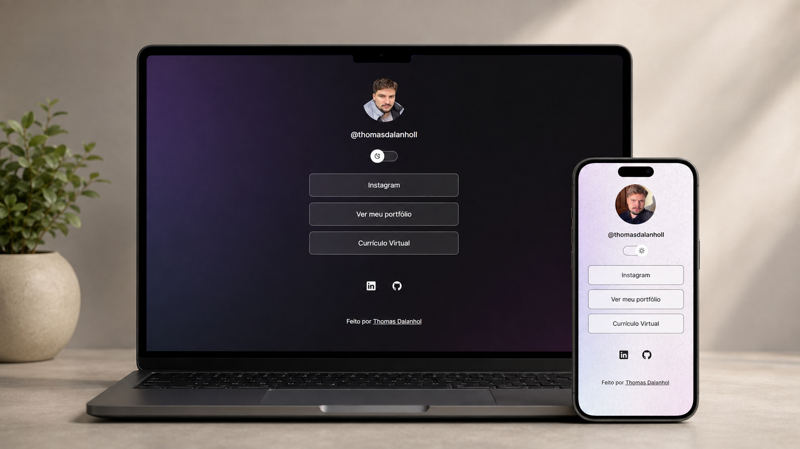

<h1 align="center"> Cartão de visitas online </h1>

  <a href="#-tecnologias">Tecnologias</a>&nbsp;&nbsp;&nbsp;|&nbsp;&nbsp;&nbsp;
  <a href="#-projeto">Projeto</a>

  

 

  

## 🚀 Tecnologias

Esse projeto foi desenvolvido com as seguintes tecnologias:

- HTML e CSS
- JavaScript
- Git e Github
- Figma

## ⚙️ Funcionalidades

- [x] Efeito hover nos botões
- [x] Dark Mode e Light Mode funcional
- [x] Animação do switch na troca de modo
- [x] Efeito hover com aspecto brilhante no footer
- [x] Efeito hover no switch
- [x] Transição suave de background ao utilizar o switch

## 💻 Projeto

O projeto é basicamente um agregador de links como um cartão de visitas online.

- [Acesse o projeto finalizado, online](https://thomassz1.github.io/Projeto)

## Licença

Esse projeto está sob a licença MIT.

---
